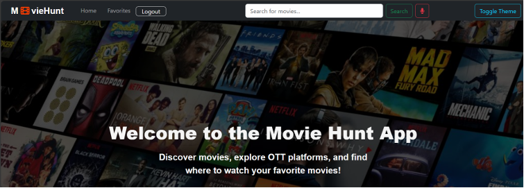
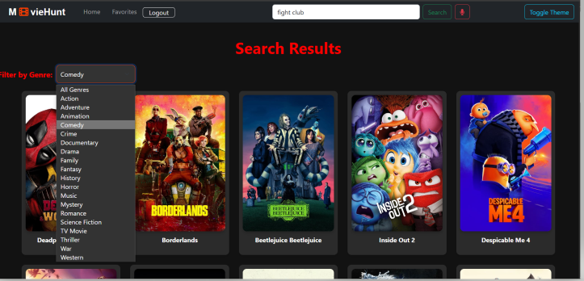
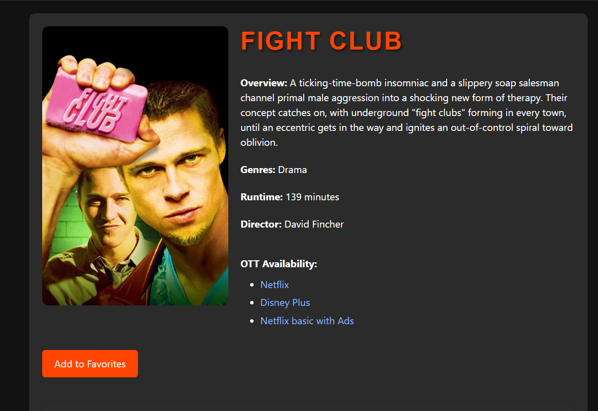
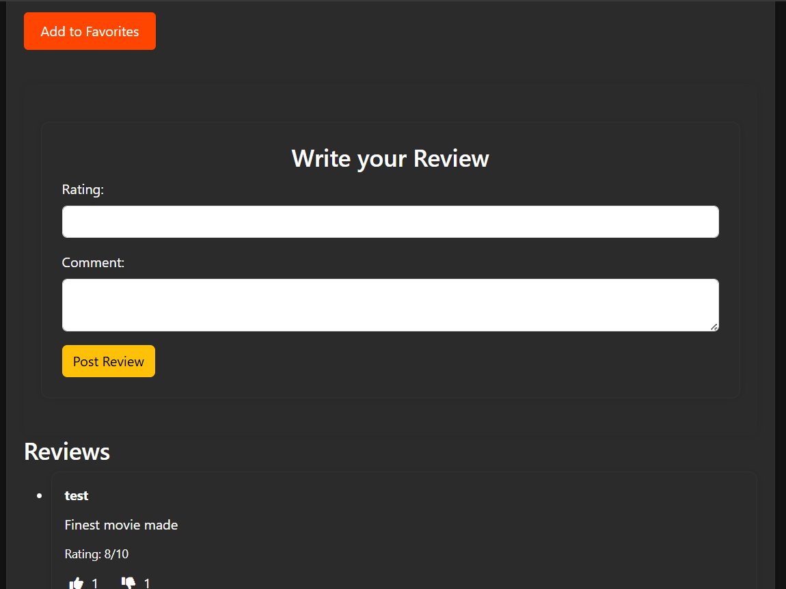

# 🎬 MovieHunt – Full Stack Movie Search App

A responsive and feature-rich movie discovery platform built using the MERN stack. Users can securely log in, search movies by title or genre, and explore real-time movie data from TMDB — with a voice-powered search option!

## 🔗 Live App
👉 [themoviehunt.vercel.app](https://themoviehunt.vercel.app)

## 📹 Project Demo (11 min)
🎥 [Watch the walkthrough video](<https://liverpool.instructuremedia.com/embed/0fef195f-d7cc-4b37-9b2f-4919a08ee056>)

---

## ✨ Features
- 🔎 Search movies by title or genre (via text or voice)
- 🔐 JWT-based user authentication with secure cookies
- 🎨 Responsive UI (currently optimized for desktop)
- 🧠 Real-time data from TMDB API
- ❤️ Save movies to favorites 
- 💬 Leave comments and reviews for movies
- 📢 Voice-based movie search (accessibility feature)

> ⚠️ Note: This version is desktop-optimized. A mobile-friendly upgrade is planned in future.

---

## 📸 Screenshots

### 📸 Screenshots








## 🛠 Tech Stack

**Frontend:**  
React, Bootstrap, CSS

**Backend:**  
Node.js, Express, MongoDB, JWT, OAuth2
Includes custom routes for authentication, favorites, and reviews

**Other Tools:**  
TMDB API, Postman, GitHub, Vercel (Frontend), Render (Backend)

---
## 💼 Contact

**Radhakrishnan Ramadas**  
📧 Email: rkrk44321@gmail.com 
💼 LinkedIn: [linkedin.com/in/radha-krishnan](https://www.linkedin.com/in/radha-krishnan-82a87517a/)

> Feel free to reach out for collaboration, freelance, or job opportunities!


## 🚀 Getting Started Locally

```bash
# Clone the repo
git clone https://github.com/RKrishnanTechie/MovieSearch.git

# Install frontend
cd MovieSearch/frontend
npm install

# Install backend
cd ../backend
npm install

# Create a .env file in /backend with:
PORT=8000
MONGODB_URI=your_mongo_connection
ACCESS_TOKEN_SECRET=your_jwt_secret
REFRESH_TOKEN_SECRET=your_refresh_secret
TMDB_API_KEY=your_tmdb_key

# Start backend
npm run dev

# Start frontend (in a separate terminal)
cd ../frontend
npm start

